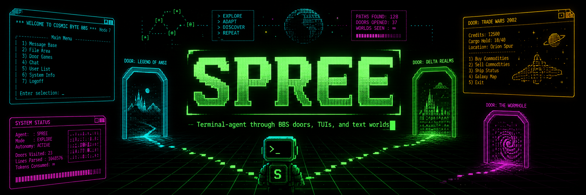

<p align="center">
  
</p>

# Spree BBS Gym

Terminal-agent sprees through BBS doors, TUIs, and text worlds.

Containerized BBS sandbox for agent experiments: LLMs connect as terminal users,
play door games, and use BBS message areas/chat through normal telnet/rlogin
interfaces.

See [DESIGN.md](DESIGN.md) for the agent/environment boundary, observation
model, timing strategy, and multi-agent plan.
See [NEXT.md](NEXT.md) for near-term implementation notes and observed failure
modes from live TW2 runs.

License: Apache-2.0, Copyright 2026 Ross Wightman.

## Current Shape

- BBS runtime: Synchronet in Docker, with persistent state in `runtime/sbbs`.
- Local service ports: telnet `127.0.0.1:2323`, web `127.0.0.1:8080`,
  rlogin `127.0.0.1:2513`, NNTP `127.0.0.1:1119`, IRC `127.0.0.1:6667`.
- Terminal-agent core: `tty_agent` owns actions, observations, model
  adapters, memory, runners, transports, observation hints, and prompt modules.
- BBS shell: `bbs_gym` owns Synchronet defaults, CP437 policy, BBS/TW2 prompt
  profiles, activity-specific prompt modules, activities, and CLI commands.
- Packaging: this repo is the `spree` workspace. It publishes `tty-agent` and
  `bbs-gym` as separate PyPI packages from `packages/tty-agent` and
  `packages/bbs-gym`.
- Agent client: `uv run bbs-gym smoke` for raw telnet/ANSI transcripts
  and `uv run bbs-gym run-activity` for bounded model-driven sessions.
  `uv run bbs-gym run-routed` keeps one session open while switching
  activity profiles from observed terminal state.
- Model providers: OpenAI-compatible chat endpoints, Anthropic Messages,
  Codex CLI, Claude CLI, and scripted test responses.
- Debug tooling: JSONL traces can be rendered with `scripts/trace_pretty.py`;
  raw transcripts can be replayed into ANSI HTML or animated GIFs with
  `scripts/ansi_screencap.py`.
- Door strategy:
  - Use Synchronet's bundled JS doors first for immediate smoke tests.
  - Stage original DOS doors from `doors/bre` and `doors/tw2002`.
  - Build the optional DOSEMU image only when original DOS doors are needed.

Synchronet was chosen because its maintained Docker image already exposes BBS
services and its external-program system supports common door dropfiles,
including `DOOR.SYS`, `DORINFO#.DEF`, `DOORFILE.SR`, and `DOOR32.SYS`.

## Quick Start

```bash
uv sync
make init
docker compose up -d
uv run bbs-gym smoke
```

If Docker does not start, run:

```bash
make doctor
```

For initial sysop configuration:

```bash
make scfg
```

For a shell inside the BBS container:

```bash
make shell
```

## Synchronet Docker Runtime

The default Compose service runs `bbsio/synchronet:3.19c` and mounts persistent
BBS state at `runtime/sbbs`. Ports are bound to loopback unless `BBS_HOST` is
changed in `.env`.

Common operations:

```bash
docker compose up -d
docker compose ps
docker compose logs -f --tail=200 bbs
docker compose down
```

The exposed local services are telnet `127.0.0.1:2323`, rlogin
`127.0.0.1:2513`, web `127.0.0.1:8080`, NNTP `127.0.0.1:1119`, and IRC
`127.0.0.1:6667`. Telnet is useful for human-realistic smoke tests; rlogin is
the preferred automation path once agent accounts are provisioned.

## Immediate Playable TradeWars-Like Door

Synchronet includes a JavaScript door named `tw2`. Install it into the BBS
configuration after the container has initialized:

```bash
make install-js-tw2
```

This gives you a fast local target for agent-session plumbing before dealing
with original DOS door setup and registration.

Reset or adjust the JS TW2 game state during development:

```bash
make reset-js-tw2
make grant-js-tw2-turns PLAYER=RLoginSmoke TURNS=30
```

`reset-js-tw2` reinitializes the local JS TW2 universe. `grant-js-tw2-turns`
updates one TW2 player record without resetting the world, which is useful for
continuing an interrupted agent session or forcing a daily-turn rollover during
experiments.

## Original DOS Doors

Put your legally obtained/extracted door files here:

```text
doors/bre/
doors/tw2002/
```

Then stage them into Synchronet's external-program tree:

```bash
make stage-dos-doors
```

Build and run with DOSEMU support:

```bash
make up-dos
```

Install the staged external-program configs:

```bash
docker compose exec bbs jsexec install-xtrn.js ../xtrn/bre -auto
docker compose exec bbs jsexec install-xtrn.js ../xtrn/tw2002 -auto
```

You still need to run each door's own setup editor to set node/dropfile paths,
game resets, and registration keys. See [docs/doors.md](docs/doors.md).

## Agent Smoke Test

```bash
uv run bbs-gym smoke \
  --host 127.0.0.1 \
  --port 2323 \
  --transcript runtime/transcripts/smoke.raw
```

The transcript is stored as raw CP437/ANSI bytes. The CLI prints a plain-text
view with ANSI control sequences removed.

The generic PTY path can be checked without the BBS:

```bash
python -m examples.shell_agent
```

Spree can also drive local text adventures through the same PTY path. Install a
terminal Z-machine interpreter such as Frotz and place your own local story
file under ignored runtime state:

```bash
sudo apt install frotz
mkdir -p runtime/zcode
# put your local Zork/Z-code story file at runtime/zcode/zork1.z3
uv run python examples/zork_agent.py runtime/zcode/zork1.z3 \
  --move look \
  --move inventory
```

Story/game data is intentionally not bundled or committed. The Zork example
uses `tty_agent` only: `PtySession`, `TerminalScreen`, `TurnObserver`, and the
`TEXT_ADVENTURE_PROFILE` prompt profile.

To let a local OpenAI-compatible model play, use the activity example. It uses
the text-adventure prompt fast path, so the runner can advance as soon as the
`>` parser prompt appears instead of waiting for BBS-style screen quiescence:

```bash
uv run python examples/zork_activity.py runtime/zcode/zork1.z3 \
  --model google/gemma-4-31B-it \
  --base-url http://127.0.0.1:8000/v1 \
  --max-decision-ticks 100
```

The same example can run a stateful Claude Code session through `claude -p`:

```bash
uv run python examples/zork_activity.py runtime/zcode/zork1.z3 \
  --provider claude \
  --model sonnet \
  --claude-stateful \
  --claude-session-file runtime/claude-sessions/zork.session \
  --max-decision-ticks 100
```

Spree can also drive Tele-Arena through the standalone Ether telnet server. The
setup is more involved because the repo does not bundle Ether, Tele-Arena data,
converted game files, or player state. See [TELE_ARENA.md](TELE_ARENA.md) for
the download, conversion, the
[`ether-arena`](https://github.com/rwightman/ether-arena) fork, and the wrapper
command:

```bash
uv run python examples/tele_arena_activity.py \
  --activity bbs-door-line \
  --provider codex \
  --model gpt-5.5 \
  --max-decision-ticks 100
```

## Activity Traces And Replays

`run-activity` writes one JSONL record per decision tick. Each record includes
the observation shown to the model, prompt-module provenance, raw and parsed
model responses, validation notes, the parsed action, budget state, and the raw
transcript path. New traces also include absolute `transcript_byte_start` and
`transcript_byte_end` offsets so replay tools can render activity traces that
share one long telnet/rlogin transcript.

`run-routed` uses the same trace format and adds `active_profile` plus
`profile_switch` events. Use `--run-objective` for a stable session goal that
stays in the prompt across profile switches, and `--profile-objective` only when
you want to replace the selected/default profile's own objective text. The
built-in route sets are:

- `tw2-auto`: start with the TW2 entry profile, then switch to the restricted
  TW2 game profile when a TW2 screen is detected.
- `bbs-auto`: start with a broader BBS door-safe profile, then specialize to
  TW2 when detected.

The `bbs-door-safe` profile is available directly through `run-activity` for
experiments with stronger models. It removes `submit_line` and biases door-game
input toward `press_key` for hotkeys and `type_text` for numeric values,
observing before pressing Enter.

The `bbs-door-line` profile is the line-oriented counterpart for doors such as
Ether/Tele-Arena where normal commands are submitted with Enter. It keeps
`submit_line` available while preserving `press_key` and `type_text` for
single-key or partial-input prompts.

`run-match` runs several agents against the same BBS or door server. Each
participant gets its own terminal session, model adapter, stateful provider
session, recent-step context, campaign memory, and per-agent trace; the match
trace records match start/completion, per-round or per-tick order, actions,
disconnects, and reconnects. The default scheduler mode is `sequential`: agents
act one at a time in the chosen per-round order. `parallel_barrier` asks active
agents for decisions concurrently, then commits actions in the chosen order.
`parallel_race` also asks concurrently, but commits each action as soon as that
agent's decision is ready. `continuous` keeps one decision in flight per active
agent and immediately requeues that agent after each committed action; faster
models get more initiative by design. The default order is fixed CLI order, but
competitive runs can use seeded shuffle or rotating first-player order. For
example, a Claude-vs-Codex Tele-Arena smoke can use:

```bash
uv run bbs-gym run-match \
  --host 127.0.0.1 \
  --port 3000 \
  --transport telnet \
  --telnet-enter lf \
  --no-agents-config \
  --activity bbs-door-line \
  --participant arena-codex:codex:gpt-5.5 \
  --participant arena-claude:claude:sonnet \
  --codex-stateful \
  --claude-stateful \
  --scheduler-mode sequential \
  --match-order shuffle \
  --match-seed 20260519 \
  --disconnect-policy reconnect \
  --disable-action hangup \
  --run-objective "Play Tele-Arena as {agent_id}. If asked for a character name, create or log in as {agent_id}. Stay connected; do not hang up or quit. Other active agents: {opponents}. Survive, gain experience and gold, buy and equip useful supplies, spend gold wisely, recover when hurt, find opponents, and defeat them when prepared." \
  --max-rounds 100 \
  --max-decision-ticks 100
```

For larger melees, put the participant roster and scheduler settings in a
TOML or JSON file:

```bash
uv run bbs-gym run-match --match-config examples/tele_arena_melee.toml
```

`examples/tele_arena_melee.toml` shows a Codex, Claude, and local
OpenAI-compatible model sharing one Tele-Arena server. Config files can set the
activity, transport, budgets, objective template, scheduler mode/order/seed,
disconnect policy, disabled actions, and per-participant provider settings.
Config values are treated as the match definition when `--match-config` is used.
For match runs, `--max-wall-seconds` is a match-level wall-clock budget shared
by all participants, while `--max-decision-ticks` is per participant. In
`continuous` mode, `--max-rounds` caps the number of queued action decisions for
the whole match instead of all-agent rounds. Continuous traces use `tick`
instead of `round` for scheduler events and do not emit `round_started` /
`round_completed` lifecycle events.

Use `--prompt-layout cache_friendly` when comparing local OpenAI-compatible
servers with prefix caching. The default `timeline_first` layout preserves the
existing trace-oriented prompt order; `cache_friendly` moves stable objectives,
static guidance, and campaign memory earlier while leaving volatile budget and
current-screen modules near the end.

Example routed TW2 run:

```bash
uv run bbs-gym run-routed \
  --route-set tw2-auto \
  --run-objective "Play the TW2 door game. Explore the universe, find profitable trade routes, earn credits, preserve turns, recover from mistakes, and quit cleanly when useful progress is done." \
  --transport telnet \
  --agents-config config/agents.local.json \
  --agent-id rlogin-smoke \
  --provider codex \
  --model gpt-5.5 \
  --max-decision-ticks 80 \
  --log-path runtime/logs/tw2-routed.jsonl
```

To start with the broad door-safe profile and let routing specialize after TW2
is detected:

```bash
uv run bbs-gym run-routed \
  --route-set bbs-auto \
  --prompt-layout cache_friendly \
  --run-objective "Play the TW2 door game. Explore the universe, find profitable trade routes, earn credits, preserve turns, recover from mistakes, and quit cleanly when useful progress is done." \
  --transport telnet \
  --provider openai-compatible \
  --model gemma4 \
  --max-decision-ticks 80 \
  --log-path runtime/logs/tw2-bbs-auto.jsonl
```

For a one-profile capable-model experiment, keep `bbs-door-safe` active for the
whole session and provide the same run-level goal:

```bash
uv run bbs-gym run-activity \
  --activity bbs-door-safe \
  --prompt-layout cache_friendly \
  --run-objective "Play the TW2 door game. Explore the universe, find profitable trade routes, earn credits, preserve turns, recover from mistakes, and quit cleanly when useful progress is done." \
  --transport telnet \
  --provider openai-compatible \
  --model gemma4
```

Pretty-print a trace:

```bash
python scripts/trace_pretty.py runtime/logs/activity.jsonl \
  --show-new-text \
  --out runtime/logs/activity.pretty.txt
```

Render a colored terminal frame or animated GIF from the raw transcript:

```bash
python scripts/ansi_screencap.py runtime/logs/activity.jsonl \
  --step 42 \
  --out runtime/logs/activity-step42.ansi.html

python scripts/ansi_screencap.py runtime/logs/activity.jsonl \
  --gif-out runtime/logs/activity.gif \
  --start-step 10 \
  --end-step 60 \
  --duration-ms 2000
```

The GIF path requires Pillow. The replay is only as colorful as the raw
transcript: if Synchronet sends monochrome output for a given rlogin/telnet
session, the GIF will be monochrome too. For current traces, transcript byte
offsets are read automatically. For older traces that do not include absolute
offsets, pass `--base-byte-offset N` when rendering an activity that starts
mid-session.

## Local vLLM OpenAI-Compatible Server

The OpenAI-compatible adapter works with local servers such as vLLM, Ollama, and
llama.cpp. The default vLLM Docker setup uses Gemma 4 31B with thinking enabled
server-wide. This is the setup used for the current local TW2 smoke runs:

```bash
docker run --rm --gpus all --ipc=host --shm-size 16g \
  -p 127.0.0.1:8000:8000 \
  -v "$HOME/.cache/huggingface:/root/.cache/huggingface" \
  vllm/vllm-openai:latest \
  --model google/gemma-4-31B-it \
  --served-model-name gemma4 \
  --tensor-parallel-size 2 \
  --max-model-len 16384 \
  --gpu-memory-utilization 0.90 \
  --dtype auto \
  --enable-auto-tool-choice \
  --reasoning-parser gemma4 \
  --tool-call-parser gemma4 \
  --chat-template examples/tool_chat_template_gemma4.jinja \
  --default-chat-template-kwargs '{"enable_thinking": true}' \
  --limit-mm-per-prompt image=0,audio=0
```

The `--served-model-name gemma4` alias matches the README run examples. Adjust
`--tensor-parallel-size`, `--max-model-len`, and `--gpu-memory-utilization` for
local hardware. For text-only BBS runs, `--limit-mm-per-prompt image=0,audio=0`
avoids multimodal profiling overhead.

With `--reasoning-parser gemma4` and
`--default-chat-template-kwargs '{"enable_thinking": true}'`, vLLM exposes
Gemma 4 thinking through the OpenAI-compatible response. Raw model responses
and parsed reasoning are kept in the JSONL trace while the action loop parses a
filtered final answer.

Response filtering is selected from the model id by default. `gemma-4` model
ids use the Gemma 4 channel/thought filter, while the default filter handles
common `<think>...</think>` style reasoning blocks. Override with
`--response-filter auto|default|gemma4|none` or `response_filter` in the agent
registry.

## Codex CLI Provider

The `codex` provider invokes `codex exec` once per decision tick and parses its
final message through the same action JSON path as the other providers. This is
useful for debugging and for trying Codex as a player without standing up a
separate API server.

```bash
uv run bbs-gym run-activity \
  --transport rlogin \
  --agent-id codex-debug \
  --provider codex \
  --model gpt-5.5 \
  --codex-sandbox read-only \
  --activity tw2-game
```

Useful options are `--codex-profile`, `--codex-executable`,
`--codex-timeout`, `--codex-cwd`, and repeated `--codex-arg=...` values for
extra `codex exec` flags. The adapter also supports the same fields in
`config/agents.local.json` under the agent's `model` object. Codex calls are
stateless from the harness perspective; the full prompt is sent each tick and
harness memory remains the source of truth.

Prompt construction defaults to `--prompt-mode stateless_full`, which sends the
full harness context every decision tick. `--prompt-mode stateful_delta` sends a
full bootstrap prompt once and then shorter delta prompts with the current
observation and previous-step summary. That mode is intended for future resumed
provider sessions such as Codex CLI resume; use it only when the provider
actually preserves prior context.

Prompt layout is separate from prompt mode. `--prompt-layout timeline_first` is
the default control layout. `--prompt-layout cache_friendly` keeps the same
information but orders stable sections before fast-changing tactical state so
vLLM-style prefix caching has a longer exact prefix to reuse.

For Codex CLI, `--codex-stateful` captures the Codex session id from `--json`
on the first call and resumes that same session on later decision ticks. When
`--codex-stateful` is set and no explicit `--prompt-mode` is provided, the
activity automatically uses `--prompt-mode stateful_delta`.

```bash
uv run bbs-gym run-activity \
  --transport rlogin \
  --agent-id codex-debug \
  --provider codex \
  --model gpt-5.5 \
  --codex-stateful \
  --activity tw2-entry
```

Use `--codex-session-file runtime/codex-sessions/codex-debug.session` if you
want the captured Codex session id persisted for later runs. Without a session
file, the session id is only kept in memory for the current process.

## Claude CLI Provider

The `claude` provider invokes the local Claude Code CLI in non-interactive
`claude -p` mode with `--output-format json`. This is separate from the
`anthropic` provider, which talks directly to the Anthropic Messages API.

```bash
uv run bbs-gym run-activity \
  --transport rlogin \
  --agent-id claude-cli-debug \
  --provider claude \
  --model claude-sonnet-4-5 \
  --activity tw2-entry
```

By default the adapter passes `--permission-mode dontAsk` and `--tools ""` so
Claude Code acts as a text decision model rather than a workspace agent. Use
`--claude-bare` only when you explicitly want Claude Code's bare mode. Useful
options are `--claude-executable`, `--claude-timeout`, `--claude-cwd`, and
repeated `--claude-arg=...` values.

For stateful Claude CLI runs, `--claude-stateful` stores the returned session id
and resumes it with `--resume` on later decision ticks. When `--claude-stateful`
is set and no explicit `--prompt-mode` is provided, the activity automatically
uses `--prompt-mode stateful_delta`.

```bash
uv run bbs-gym run-activity \
  --transport rlogin \
  --agent-id claude-cli-debug \
  --provider claude \
  --model claude-sonnet-4-5 \
  --claude-stateful \
  --claude-session-file runtime/claude-sessions/claude-cli-debug.session \
  --activity tw2-entry
```

## Agent Accounts

Copy the example identity registry and put real passwords in environment
variables or an ignored local config:

```bash
cp config/agents.example.json config/agents.local.json
uv run bbs-gym accounts list
uv run bbs-gym accounts check
uv run bbs-gym accounts provision
```

`accounts provision` creates or updates Synchronet users through `jsexec`.
Automated runs can then use deterministic rlogin identity:

```bash
uv run bbs-gym run-activity \
  --transport rlogin \
  --agent-id qwen-local-001
```

The rlogin transport defaults to terminal type `ansi`. Use
`--rlogin-terminal` to compare terminal negotiation strings such as `ansi`,
`xterm`, or `xterm-256color` when debugging color/ANSI behavior.

## Notes

- The default Compose file binds to loopback only. Change `BBS_HOST` in `.env`
  if you intentionally want to expose the BBS.
- Apple Silicon Macs are a later target for the BBS and JS doors. Original DOS
  doors through DOSEMU should be treated as x86_64 Linux-first.
- Door binaries are ignored by git by default.

## Sources

- [bbsio/synchronet Docker image](https://hub.docker.com/r/bbsio/synchronet)
- [Synchronet external program/dropfile docs](https://www.synchro.net/docs/external_programs.html)
- [Synchronet install-xtrn module](https://wiki.synchro.net/module:install-xtrn)
- [TradeWars on Linux/DOSEMU notes](https://www.arcadiabbs.com/setting-up-tradewars-on-linux/)
- [vLLM Gemma 4 usage guide](https://docs.vllm.ai/projects/recipes/en/latest/Google/Gemma4.html)
- [vLLM reasoning outputs](https://docs.vllm.ai/en/latest/features/reasoning_outputs/)
